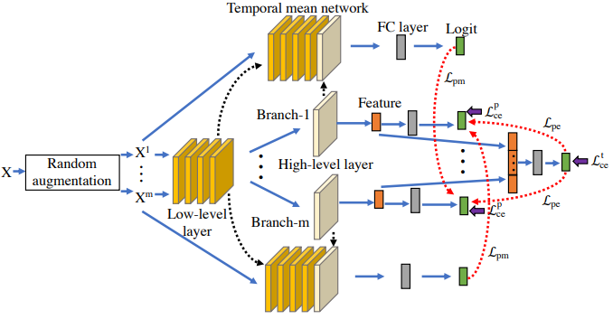

# Peer Collaborative Learning for Online Knowledge Distillation

[TOC]

## Introduction

Reproduction of ***Peer Collaborative Learning for Online Knowledge Distillation*** in AAAI2021, the paper link is at [here]([PRELIMINARY VERSION DO NOT CITE (aaai.org)](https://www.aaai.org/AAAI21Papers/AAAI-3270.WuG.pdf))



## Dependence

- torch==1.5.1
- torchvision==0.6.1
- easydict==1.9
- tensorboard==2.4.1
- tensorboardX==2.1
- PyYAML==5.3.1

## Train

- Firstly, config your dataset root at `./src/datasets/dataset_config.yml`
- run code (method 1)

```shell
python main.py --model resnet32 --save_dir cifar100_resnet32 --config_path ./configs/cifar100.yml
```

- or you can run code (method 2)

```shell
sh run_cifar100.sh
```

## Note

In our replementation, we recored the best accuracy score among the three peers, instead of the first peer in original paper. And we only report result over 1 run time.

## Results

all the replemetation training logs can be downloaded in package at [pan.baidu]() code:

### CIFAR100

| Network        | DML        | CL         | ONE        | FFL-S      | OKDDip     | KDCL       | PCL        | ours  |
| -------------- | ---------- | ---------- | ---------- | ---------- | ---------- | ---------- | ---------- | ----- |
| ResNet-32      | 73.68±0.14 | 72.33±0.46 | 73.79±0.41 | 72.18±0.11 | 73.25±0.38 | 73.76±0.34 | 74.14±0.16 | 74.77 |
| ResNet-110     | 77.86±0.50 | 78.83±0.58 | 78.40±0.36 | 77.22±0.41 | 78.54±0.26 | 78.28±0.32 | 79.98±0.55 |       |
| VGG-16         | 75.52±0.10 | 74.33±0.08 | 74.37±0.39 | 70.87±0.99 | 74.68±0.05 | 75.67±0.22 | 76.89±0.25 | 76.98 |
| DenseNet-40-12 | 73.06±0.31 | 71.45±0.34 | 71.60±0.38 | 71.25±0.35 | 71.23±0.14 | 72.52±0.42 | 73.09±0.16 | 73.11 |
| WRN-20-8       | 79.77±0.07 | 79.40±0.12 | 79.10±0.39 | 78.22±0.14 | 78.83±0.06 | 79.37±0.30 | 80.51±0.49 |       |

### CIFAR10

| Network        | DML        | CL         | ONE        | FFL-S      | OKDDip     | KDCL       | PCL        | ours  |
| -------------- | ---------- | ---------- | ---------- | ---------- | ---------- | ---------- | ---------- | ----- |
| ResNet-32      | 93.94±0.07 | 94.02±0.28 | 94.20±0.12 | 94.01±0.11 | 94.17±0.15 | 94.01±0.08 | 94.33±0.12 | 94.35 |
| ResNet-110     | 94.53±0.25 | 95.19±0.11 | 95.16±0.30 | 94.72±0.06 | 95.14±0.10 | 95.11±0.16 | 95.53±0.16 |       |
| VGG-16         | 94.13±0.07 | 94.14±0.15 | 94.14±0.23 | 93.22±0.08 | 93.98±0.06 | 94.09±0.12 | 94.74±0.02 | 93.87 |
| DenseNet-40-12 | 93.59±0.26 | 93.05±0.25 | 93.08±0.21 | 93.28±0.16 | 92.64±0.22 | 93.87±0.08 | 94.13±0.13 | 93.69 |
| WRN-20-8       | 95.20±0.13 | 94.59±0.08 | 94.70±0.14 | 94.72±0.13 | 94.83±0.15 | 95.27±0.16 | 95.42±0.04 |       |

## Acknowledgement

This work is developed based on the following works:

[shaoeric/torch-atom: A basic and simple training framework for pytorch. Easy to expand for multi network interaction. (github.com)](https://github.com/shaoeric/torch-atom)

[CuriousAI/mean-teacher: A state-of-the-art semi-supervised method for image recognition (github.com)](https://github.com/CuriousAI/mean-teacher)

[DefangChen/OKDDip-AAAI2020: This is a PyTorch-1.0 implementation for the AAAI-2020 paper (Online Knowledge Distillation with Diverse Peers). (github.com)](https://github.com/DefangChen/OKDDip-AAAI2020)

## Citation

If you find this project useful in your research, please consider cite:

```
@misc{2022torchatom,
    title={Torch-atom: A basic and simple training framework for pytorch},
    author={Baitan Shao},
    howpublished = {\url{https://github.com/shaoeric/torch-atom}},
    year={2022}
}
```
